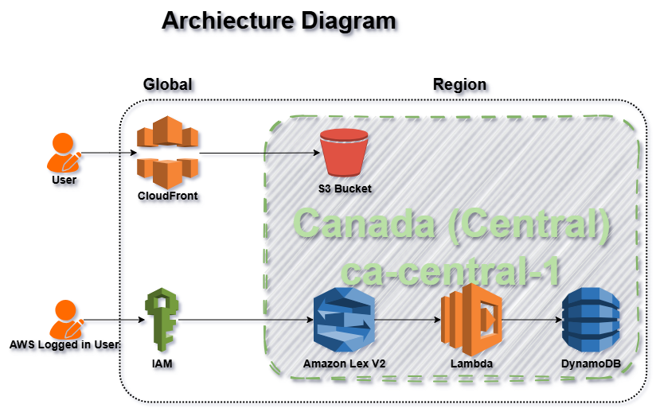

# SwiftLine Logistics AI Chatbot

### Assessment: Solutions Engineer - Candidate Larry

This repository contains the architectural design and source code for a serverless AI chatbot solution designed for **SwiftLine Logistics**. The system allows customers to retrieve real-time order status, delivery estimates, and item details using natural language queries and their Tracking ID.



---

## Architecture Overview

The solution utilizes a fully **Serverless** and **Event-Driven** architecture on AWS to ensure scalability, cost-efficiency, and minimal operational overhead.

* **Frontend:** A lightweight chat interface hosted on **Amazon S3**, served globally via **Amazon CloudFront** (CDN) for HTTPS security and low latency.
* **AI/NLU:** **Amazon Lex V2** handles natural language understanding, intent recognition, and slot filling.
* **Backend:** **AWS Lambda** (Python) executes business logic, processing Lex events and fetching data.
* **Database:** **Amazon DynamoDB** stores order information with single-digit millisecond latency.
* **Security:** **AWS IAM** follows least-privilege principles. **OpenID Connect (OIDC)** secures the CI/CD pipeline.
* **Observability:** **Amazon CloudWatch** and **AWS X-Ray** provide logging and distributed tracing.

---

## Project Structure

```text
.
├── .github/workflows/    # CI/CD Pipelines (OIDC Authentication)
├── backend/              # Lambda Function logic (Python)
├── data/                 # Sample DynamoDB JSON data
├── frontend/             # Static Website (HTML/CSS)
├── infrastructure/       # Terraform IaC configuration
│   ├── main.tf           # Core infrastructure definition
│   ├── lex_bot_template.yaml # CloudFormation template for Lex V2
└── README.md             # Project Documentation
```
---
# Deployment Instructions

This guide outlines the steps to deploy the SwiftLine Logistics AI Chatbot to AWS using Terraform and GitHub Actions.

## Prerequisites

Before proceeding, ensure you have the following:
* **AWS Account**: Access to an AWS account with administrative privileges.
* **GitHub Repository**: This codebase pushed to a GitHub repository.

---

## Step 1: Bootstrap Infrastructure State
Terraform requires an S3 bucket to store its state file ("memory"). Terraform cannot create this bucket itself because it needs the bucket to remember that it created it.

1.  Login to you AWS Account.
2.  Go to S3 dashboard.
3.  Select any region of your choice. I am using the `ca-central-1` Region *(and not `us-east-1` because it was shown to be used by almost half the internet in October 20, 2025 during the outage)*
4.  Create the state bucket in `ca-central-1` (or any region of your choice) (ensure the name is unique):
    ```bash
    swiftline-tfstate-candidate-larry
    ```
3.  *Note:* Ensure the bucket name and region matches the `backend "s3"` configuration in `infrastructure/main.tf`.

---

## Step 2: Configure OIDC Authentication
To secure the CI/CD pipeline, we use **OpenID Connect (OIDC)** instead of long-lived AWS Access Keys. This allows GitHub Actions to assume an IAM Role securely.

### A. Create the Identity Provider
1.  Go to the **IAM Console** > **Identity providers**.
2.  Click **Add provider**.
3.  Select **OpenID Connect**.
4.  **Provider URL**: `https://token.actions.githubusercontent.com`
5.  **Audience**: `sts.amazonaws.com`

### B. Create the IAM Role
1.  Go to **Roles** > **Create role**.
2.  Select **Web identity**.
3.  Select the Provider you just created.
4.  **GitHub Organization**: Your GitHub Username.
5.  **GitHub Repository**: `swiftline-assessment` (or your exact repo name).
6.  **Branch**: Select "Any" or input `main`.
7.  Attach the **AdministratorAccess** policy (or a custom scoped policy for Terraform).
8.  Name the role: `GitHubActions-DeployRole`.

### C. Verify Trust Policy
Ensure the role's **Trust Relationship** looks like this:
```json
{
    "Version": "2012-10-17",
    "Statement": [
        {
            "Effect": "Allow",
            "Principal": {
                "Federated": "arn:aws:iam::<YOUR_ACCOUNT_ID>:oidc-provider/token.actions.githubusercontent.com"
            },
            "Action": "sts:AssumeRoleWithWebIdentity",
            "Condition": {
                "StringLike": {
                    "token.actions.githubusercontent.com:sub": "repo:<YOUR_GITHUB_USER>/<YOUR_REPO_NAME>:*"
                }
            }
        }
    ]
}
```
